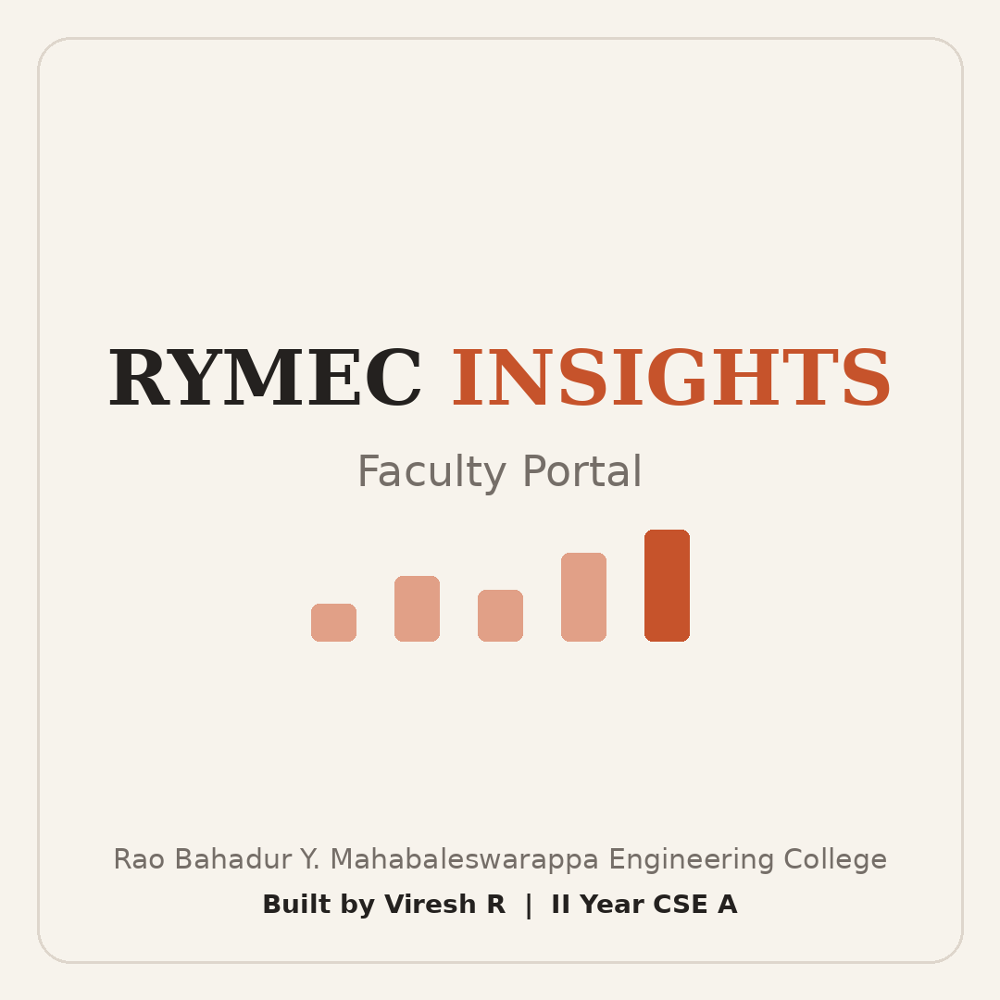
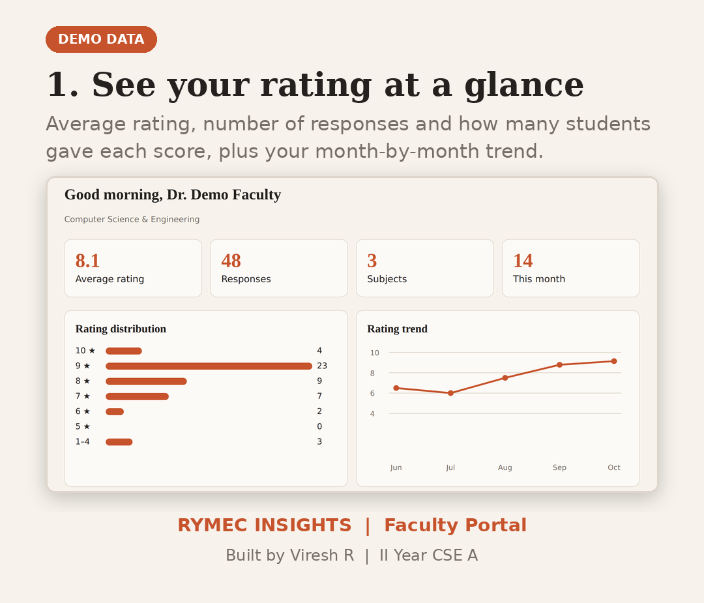
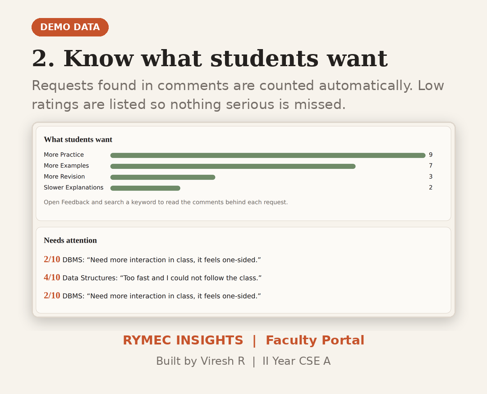
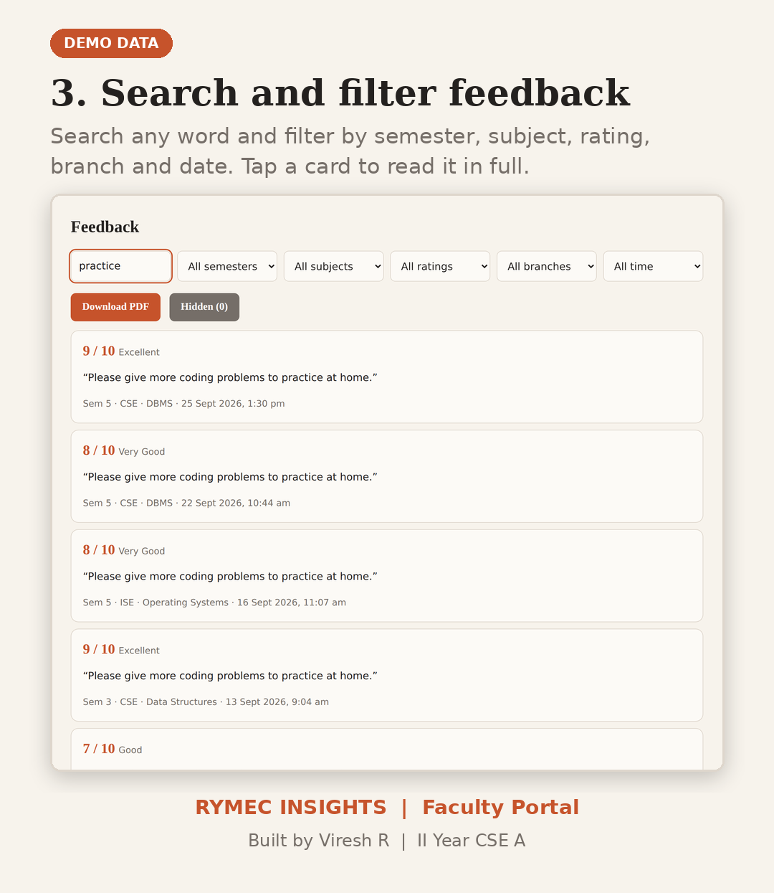
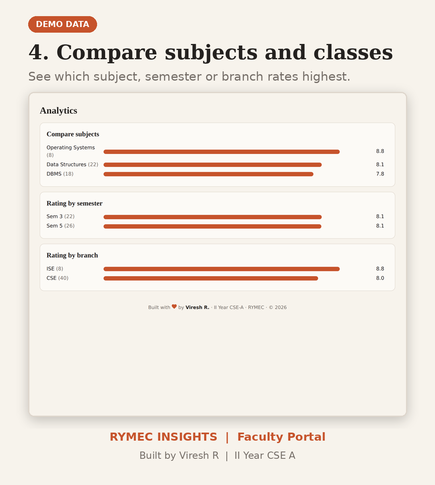
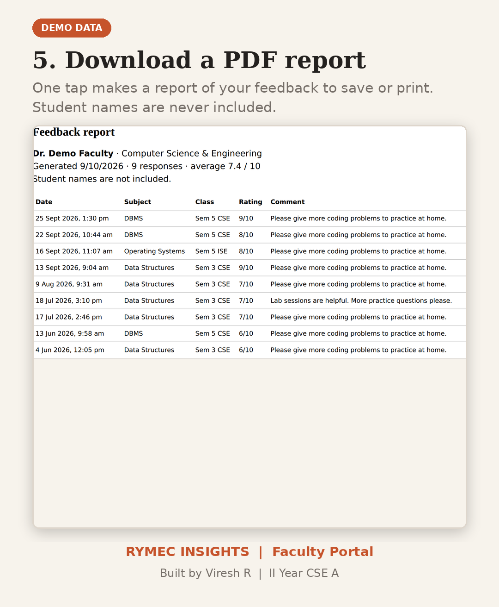
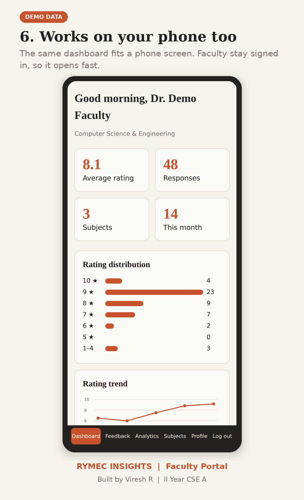

<p align="center">
  
</p>

<h1 align="center">RYMEC Insights</h1>
<p align="center"><b>Faculty Portal</b><br>Rao Bahadur Y. Mahabaleswarappa Engineering College</p>

<p align="center">
  <a href="https://rymec-insights.vercel.app/"><b>Live site</b></a> ·
  <a href="https://github.com/veereshr4446/Student-feedback-page">Student site repo</a>
</p>

---

## About

RYMEC Insights is where teachers read and understand the feedback their students give. Each teacher signs in and sees only their own results: ratings, trends, comments and what students are asking for. It works on laptops and phones.

> The screenshots below use **demo data** with a made-up teacher. No real student or teacher information is shown.

## Screenshots

| | |
|---|---|
|  |  |
|  |  |
|  |  |

## Features

**Dashboard**
- Average rating, total responses, subjects and responses this month
- Rating distribution from 1 to 10
- Month-by-month rating trend
- **What students want:** requests found automatically in comments (more practice, more examples, more revision, slower explanations)
- **Needs attention:** the latest low ratings (1 to 4)

**Feedback**
- Search comments and filter by semester, subject, rating, branch and date
- Open any feedback to read it in full
- **Hide / Restore** a feedback from your own list (nothing is deleted, and hidden feedback still counts in the stats)
- **Download PDF** report of the current list, without student names

**Analytics and profile**
- Compare subjects, semesters and branches
- Subject-wise averages and response counts
- Profile with Faculty ID, username and summary

**Accounts**
- Username and password login
- Stays signed in on the device for up to 180 days, with the last dashboard shown instantly
- Forgot password: **3 single-use recovery codes** per teacher
- 5 wrong attempts blocks the account for 15 minutes

## Privacy and security

- Every teacher sees **only their own** feedback. The server checks the teacher's identity on every request.
- Passwords and recovery codes are stored hashed, never as plain text.
- Students who tick "Hide my name from faculty" appear as "Anonymous" with no USN.
- A password reset signs the teacher out of all old devices.
- The backend and its secret key are private and are **not** in this repository.

## Tech stack

| Part | Technology |
|---|---|
| Frontend | HTML, CSS, vanilla JavaScript (no framework) |
| Backend | Google Apps Script (private, not in this repo) |
| Database | Google Sheets |
| Hosting | Vercel (free) |

## Project structure

```
Faculty-portal-page/
├── index.html      Page structure
├── style.css       Design and print styles
├── app.js          Login, dashboard, analytics, filters, PDF
└── screenshots/    README images (demo data)
```

## Run it locally

```bash
git clone https://github.com/veereshr4446/Faculty-portal-page.git
cd Faculty-portal-page
python -m http.server 8000
```

Open `http://localhost:8000`. Near the top of `app.js`, `API` holds the backend address. Point it to your own Google Apps Script Web app URL. Without the private backend the page loads but cannot sign anyone in.

## Deploy

1. Import the repo into [Vercel](https://vercel.com).
2. Set the preset to **Other** and leave the build settings empty.
3. Deploy.

## Who manages accounts

Faculty accounts are created and managed by the system administrator in the Google Sheet. Teachers do not register themselves.

## Author

**Viresh R**, II Year CSE A, RYMEC

© 2026 RYMEC Insights. All rights reserved.
